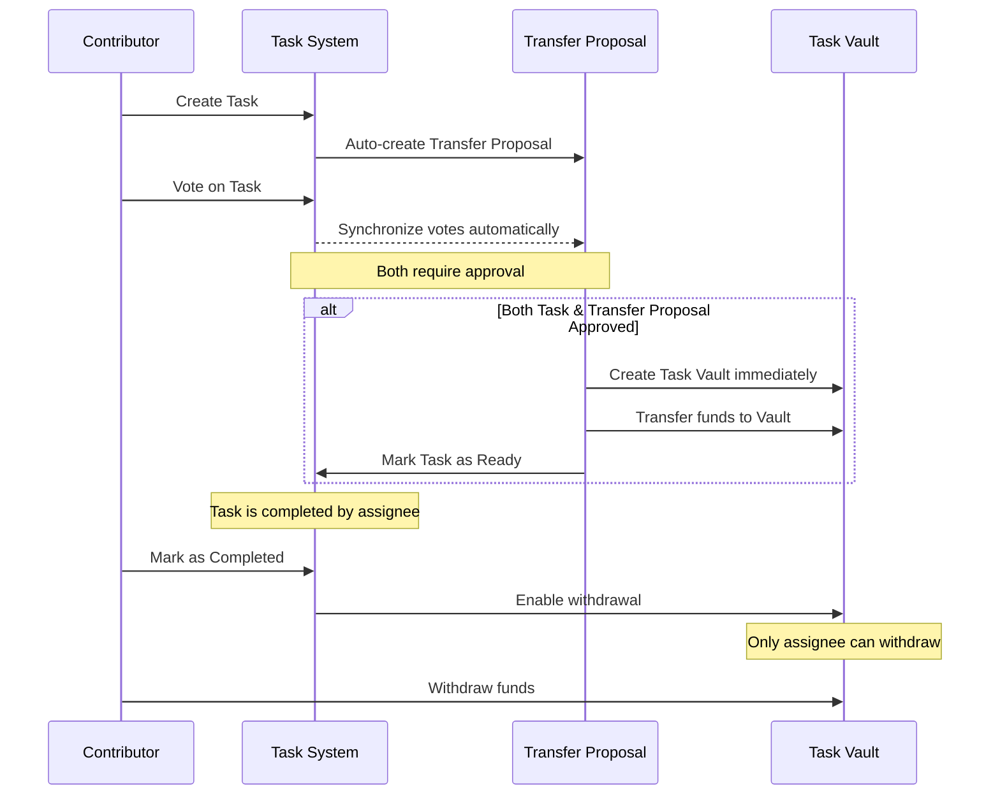

# Task-Treasury Vault Enhancement Requirements

## 1. Overview

This document outlines the requirements for enhancing the Deorg Voting Program to connect task management with treasury operations, creating a seamless workflow for task payment approval and disbursement.

### Objectives

- Link Task creation with Transfer Proposal creation
- Synchronize votes between Tasks and their linked Transfer Proposals
- Create a secure vault mechanism for task payments
- Provide a controlled withdrawal process for task assignees

## 2. Detailed Requirements

### 2.1 Task & Transfer Proposal Integration

- When a Task is created, a corresponding Transfer Proposal shall automatically be created
- Votes cast on a Task shall automatically apply to its linked Transfer Proposal and vice versa
- Both the Task and Transfer Proposal must be approved for the workflow to proceed
- Task status shall reflect the state of both approvals

### 2.2 Task Vault Mechanism

- A vault shall be created immediately after both Task and Transfer Proposal are approved
- Funds shall be transferred from treasury to the vault upon creation
- The vault shall be linked to a specific task and assignee
- Only the assigned person can withdraw from the vault
- Withdrawal shall only be possible after task completion

### 2.3 Workflow Stages

1. **Task Creation**: Create both Task and Transfer Proposal
2. **Voting Phase**: Apply votes to both entities automatically (synchronized voting)
3. **Approval Stage**: When both are approved, create vault and transfer funds immediately
4. **Execution Phase**: Task is marked as "Ready" and can be worked on
5. **Completion Stage**: Task is marked as "Completed" and withdrawal is enabled
6. **Withdrawal Phase**: Assignee can withdraw funds from the vault

## 3. State Changes

### 3.1 Enhanced Task Status Enum

```rust
#[derive(AnchorSerialize, AnchorDeserialize, Clone, PartialEq, Eq)]
pub enum TaskStatus {
    Proposed,   // Initial state
    Approved,   // Task has received enough votes
    Ready,      // Both task and transfer proposal approved, funds in vault
    Completed,  // Work is completed, ready for withdrawal
    Rejected,   // Task was rejected
}
```

### 3.2 Enhanced Task Struct

```rust
#[account]
pub struct Task {
    pub project: Pubkey,
    pub title: String,
    pub payment_amount: u64,
    pub assignee: Pubkey,
    pub votes_for: u32,
    pub votes_against: u32,
    pub status: TaskStatus,
    pub voters: Vec<Pubkey>,
    // New fields
    pub transfer_proposal: Pubkey,  // Link to the treasury transfer proposal
    pub vault: Option<Pubkey>,      // Link to the task vault once created
}
```

### 3.3 New TaskVault Account

```rust
#[account]
pub struct TaskVault {
    pub task: Pubkey,
    pub token_mint: Pubkey,
    pub token_account: Pubkey,
    pub amount: u64,
    pub assignee: Pubkey,
    pub is_withdrawable: bool,
}
```

## 4. Instruction Modifications and Additions

### 4.1 Modified Instructions

1. **create_task**

   - Create both task and transfer proposal
   - Initialize task with reference to transfer proposal
   - Apply creator's vote to both

2. **vote_on_task**

   - Apply vote to both task and transfer proposal automatically
   - Check if both meet approval thresholds
   - If both approved, trigger vault creation immediately

3. **vote_on_funds_transfer_proposal**

   - Apply vote to both transfer proposal and linked task automatically
   - Check if both meet approval thresholds
   - If both approved, trigger vault creation immediately

4. **complete_task**
   - Mark task as completed
   - Enable withdrawal from vault

### 4.2 New Instructions

1. **create_task_vault**

   - Create vault when both task and transfer proposal are approved
   - Transfer funds from treasury to vault
   - Update task status to "Ready"

2. **withdraw_from_task_vault**
   - Allow assignee to withdraw funds after task completion
   - Verify signer is the assignee
   - Transfer funds from vault to assignee's account

## 5. Workflow Diagram

```
Task Creation → Voting → Both Approved → Vault Creation →
Task Ready → Task Completed → Withdrawal Enabled → Funds Withdrawn
```

Detailed sequence:



## 6. Implementation Guidelines

### 6.1 Error Handling

Add new error codes to handle:

- Unauthorized withdrawal attempts
- Task not ready for vault creation
- Vault already exists for task
- Insufficient funds in treasury
- Attempting to withdraw before task completion

### 6.2 Security Considerations

- Strictly verify the signer is the assignee for withdrawals
- Implement proper PDA derivation for the vault and its authority
- Ensure atomic transactions where appropriate
- Validate all account relationships and ownership

### 6.3 Testing Scenarios

1. Complete happy path (creation → approval → vault → completion → withdrawal)
2. Task approved but transfer rejected
3. Transfer approved but task rejected
4. Unauthorized withdrawal attempt
5. Multiple voting scenarios with different outcomes
6. Voting on transfer proposal affecting linked task

## 7. Additional Considerations

- The implementation should be backward compatible with existing tasks
- Consider adding migration instructions for existing tasks if needed
- Maintain appropriate events for all key actions
- Consider gas optimization for transactions involving multiple account updates
